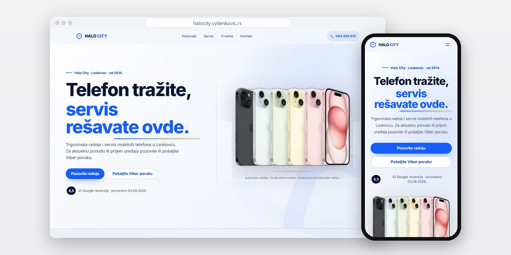
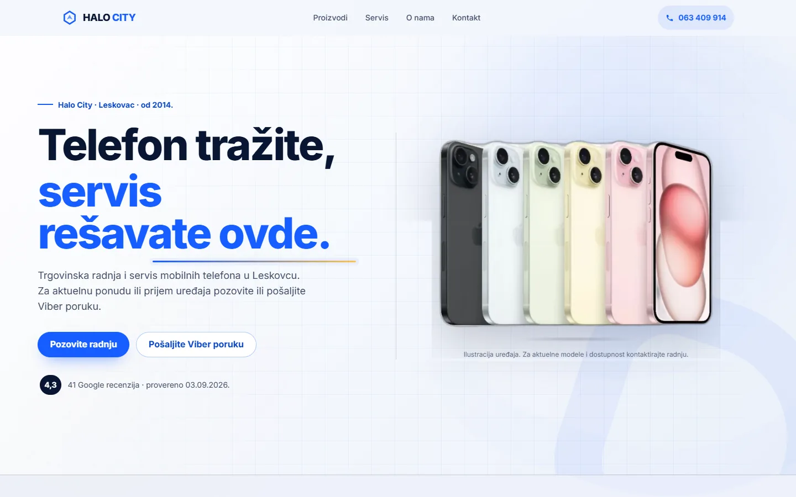
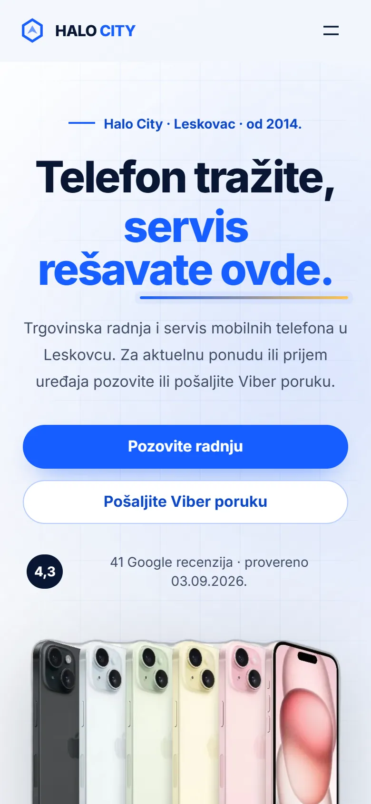
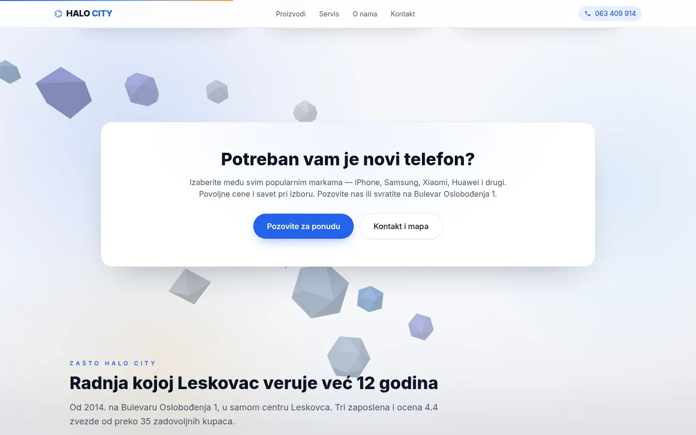
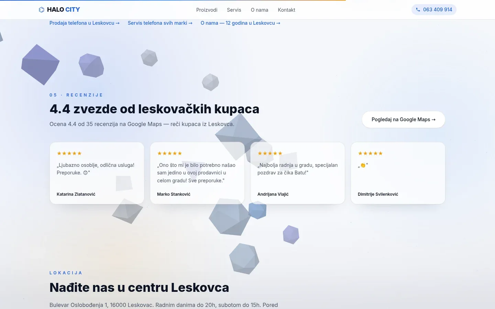

# Halo City Leskovac

Sajt od pet strana za prodaju i servis telefona u Leskovcu, gde svako dugme za kontakt vodi na poziv ili Viber poruku.

**[halocity.svilenkovic.rs](https://halocity.svilenkovic.rs/)** · [Studija slučaja](https://svilenkovic.rs/radovi/halo-city-leskovac) · [English](README.md)

> [!NOTE]
> Klijentski projekat. Izvorni kod pripada klijentu i čuva se u privatnom repozitorijumu. Ova stranica opisuje šta sam uradio i kako.

<table>
  <tr><td><b>Klijent</b></td><td>Halo City</td></tr>
  <tr><td><b>Delatnost</b></td><td>Prodaja i servis mobilnih telefona</td></tr>
  <tr><td><b>Lokacija</b></td><td>Leskovac</td></tr>
  <tr><td><b>Vrsta</b></td><td>Sajt sa više strana</td></tr>
  <tr><td><b>Moj deo posla</b></td><td>Dizajn, izrada, SEO, hosting i održavanje</td></tr>
  <tr><td><b>Tehnologije</b></td><td>Next.js 16, React 19, Tailwind 4, TypeScript</td></tr>
</table>

## O projektu

Halo City od 2014. prodaje i popravlja mobilne telefone u centru Leskovca, a kupci dolaze i iz Vlasotinca, Lebana, Bojnika i Medveđe. Kupovina telefona i pukao ekran su dve različite pretrage, a jedna duga strana mogla bi da se rangira samo za jednu od njih. Zato sajt ima pet strana, a proizvodi i servis imaju svaki svoj naslov, opis i adresu.

Zalihe i cene se menjaju prečesto da bi stajale na sajtu, pa ih nema, a strana to jasno kaže. Umesto toga na sajtu piše šta treba poslati pre dolaska: proizvođač, tačan model, memorija i boja za kupovinu, a za servis model, opis kvara, da li se telefon uključuje i da li je pao ili bio u tečnosti. Dugme za Viber otvara poruku u kojoj je taj obrazac već započet, drugačiji na svakoj strani. Na strani servisa je i kratak spisak za predaju telefona: napravite rezervnu kopiju podataka, izvadite memorijsku karticu i nikad ne šaljite šifru telefona u poruci.

## Šta sam uradio

- Pet strana i politika privatnosti: početna, proizvodi, servis, o nama i kontakt
- Telefon i Viber na svakom ekranu, bez kontakt forme, jer iza pulta tokom dana niko ne prati sanduče
- Podaci o firmi na strani o nama usklađeni sa javnim registrom privrednih subjekata
- Ocena sa Google profila prikazana zajedno sa datumom kada je poslednji put proverena
- Ispravljena greška sa pristankom: traka ga je upisivala pod jednim imenom, a analitika čitala pod drugim, pa se posetioci koji se vrate nikad nisu brojali
- Selidba na nov host sa preusmerenjima 301 u jednom skoku i očuvanim putanjama, a isti plan čeka i sopstveni domen radnje

## Merenja

| | Performanse | Pristupačnost | Dobre prakse | SEO |
| :-- | :-: | :-: | :-: | :-: |
| Telefon | 96 | 100 | 100 | 100 |
| Desktop | 100 | 100 | 100 | 100 |

PageSpeed Insights, laboratorijsko merenje živog sajta, septembar 2026. Sigurnosna zaglavlja: 6 od 6. HTML validator: bez grešaka. axe provera pristupačnosti: bez prekršaja. Strukturisani podaci: `MobilePhoneStore`, `Organization`.

## Snimci ekrana

<table>
  <tr>
    <td width="68%" valign="top"></td>
    <td width="32%" valign="top"></td>
  </tr>
</table>

Prodaja, servis i oprema, pa traka "Radnja kojoj Leskovac veruje već 12 godina"

Recenzije kupaca sa Google Maps-a, ispod njih lokacija i radno vreme

---

Izrada: [D. Svilenković](https://svilenkovic.rs).
